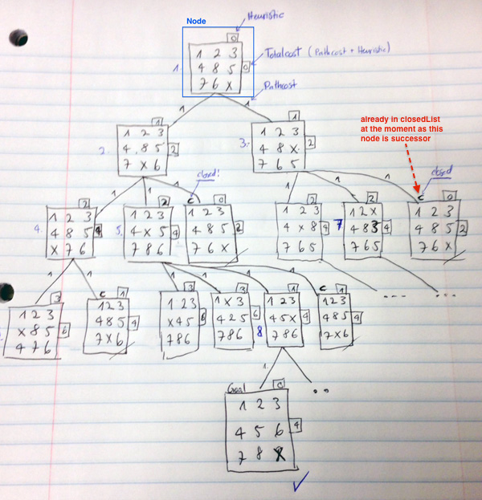

<h1>A-star Search</h1>

CS 165A – Artificial Intelligence, Winter 2014
 
Machine Problem 1

by

Marc Juchli / mail@marcjuch.li

(February 04, 2014)

<h2>General</h2>

### Programming Language

The application is based on Java. 

### Program Execution

Within the `src` folder:

	make
	java NPuzzle.Main ./testPuzzle.txt
	cat solution.txt
	
Note: solution.txt will be overriden each time the program is executed.

<h2>Design</h2>

### Main

The main is just for demonstration purposes. It's main method takes the first argument an passes this to a new Instance of AStarSearch. It will also measure the execution time an writes the output to the standard output as well as to the solution.txt

### Node

This class represents the state including all necessary arguments such as:

- successors
- costs
- pathCost
- heuristicCost
- parent
- puzzle
- xX
- yX
- path

#### findX

This is a helper method to determine the position of the character "X" within the array and will therefore update the coordinates `xX` as well as `yX`.

#### getSuccessors

This is a key method. It will lookup all possible successors for a given node. There are four cases they have to be considered:

1. Left
2. Right
3. Up
4. Down

The 2-dimensional array structure can be used as a coordinate system. For example to check if the X can be moved to the left, the following code will help to determine whether it is possible and what the new state should look like:

	//find left
	if(xX != 0){
		String[][] leftPuzzle = new String[n][n];
		leftPuzzle = copyPuzzle(leftPuzzle, this.puzzle, n);
		leftPuzzle[yX][xX] = leftPuzzle[yX][xX-1];
		leftPuzzle[yX][xX-1] = "X";
		Node leftNode = new Node(leftPuzzle, this, "l");
		successors.add(leftNode);
	}

### Search

The abstract class called "Search" provides general functionality in order to use a search algorithm. In this case it means taking a String input and generate a "state" (Node) for further usage.

There are two arguments defined:

- goalNode
- startNode

#### Constructor

The constructor takes an input (String) which represents a path to a text file. Then three steps will be proceeded:

1. Read the file and generate a 2-dimensional array
2. Generate start state from given array
3. Generate goal state based on the start state

#### readFile

Using Java's "BufferedReader" the input file will be read line by line what generates a String. 

#### generateStateFromString

Called by the constructor itself, this method will generate a 2-dimensional string array (String[][]) and thus defines the state. 

Input:

	1 2 3 
	4 8 5 
	7 6 X

Will be handled as one line containing whitespaces and newlines:

	1 2 3 \n4 8 5 \n7 6 X\n

Generates the following output:

	[[1, 2, 3], [4, 8, 5], [7, 6, X]]
	
#### getGoalState

Called by the constructor after the length of the start state is known. This method takes an argument length, which represents the N of the puzzle, and therefore generates the goal state.

Let's say the length is 3 from our example:

	[[1, 2, 3], [4, 8, 5], [7, 6, X]]

Per definition the goal state will look as follows:

	[[1, 2, 3], [4, 5, 6], [7, 8, X]]

#### comparePuzzle

This method is a helper to compare if 2 given puzzles (String[][]) are equivalent in the meaning that they contain for each field the same value.

### AStarSearch

This is the actual A-star search class that extends form the previously described "Search" class. It hold the additional arguments:

- openList
- closedList

#### searchQueue

This is a helper method to search a PriorityQueue for a specific Node and returns true if their states (puzzles) match. 

#### heuristics

Will return the `manhattan distance` (int) between the state of a given node and the goal state. 

http://en.wikipedia.org/wiki/Taxicab_geometry

#### search

Astar: see Algorithm details

<h2>Algorithm details</h2>

### Pseudocode

	Create a node containing the goal state goalNode
	Create a node containing the start state startNode
	Put startNode on the open list
	while the OPEN list is not empty
	{
	Get the node off the open list with the lowest f and call it currentNode
	if currentNode is the same state as goalNode we have found the solution; break from the while loop
	    Generate each state successorNode that can come after currentNode. 
	    Set currentNode as parent and h to be the estimated distance to goalNode (Using the heuristic function)
	    for each successorNode of currentNode
	    {
			Set the cost of successorNode to be the cost of currentNode plus the cost to get to successorNode from node_current (f=g+h)
			find successorNode on the OPEN list
			if successorNode is on the OPEN list but the existing one is as good or better then discard this successor and continue
			if successorNode is on the CLOSED list but the existing one is as good or better then discard this successor and continue
			Remove occurrences of successorNode from OPEN and CLOSED
			Add successorNode to the OPEN list
		}
		Add currentNode to the CLOSED list
	}
		
### openList / closelist

The openList as well as the closeList help to determine if a state was already visited and therefore does not have to be checked again. Both lists are implemented as PriorityQueues in order to get the states with the lowest costs first. The following comparator will help to determine which Node to take first:

	o1.costs < o2.costs ? -1 : o1.costs == o2.costs ? 0 : 1; 
	
### timer

In order to break the algorithm after 30 minutes, the start time is set before the while loop and will be checked each iteration.

	long start = System.currentTimeMillis();
	long end = start + 30*60*1000; // 30*60 seconds * 1000 ms/sec
		
	while(!openList.isEmpty()){

		if (!(System.currentTimeMillis() < end)){
			throw new Exception("30min are over.");
		}
			

### Graphic

The following graphic should get an idea how the components of the program are used within the algorithm.

The following part describes each step of the algorithm, referenced with the graphic:

	while(!openList.isEmpty()){

			if (!(System.currentTimeMillis() < end)){
				throw new Exception("30min are over.");
			}
			
			Node currentNode = openList.poll();
			
			if (comparePuzzle(currentNode.puzzle, goalNode.puzzle)) return currentNode;
			
As we can see is that on each iteration step of the while loop, we are polling the node containing the smallest costs (graphic: Totalcost) out of the PriorityQueue. This is now the currentNode (graphic: Node). If this node contains our goalState, then we're done.
			
			for(Node successor : currentNode.getSuccessors()){
			
Now we determine all possible children of the currentNode and loop over them with a enhanced for loop. 
				
				Node findOpen = searchQueue(successor, openList);
				Node findClosed = searchQueue(successor, closedList);
				
				if (findOpen != null && findOpen.compareTo(successor) <= 0) continue;
				if (findClosed != null && findClosed.compareTo(successor) <= 0) continue;

If a successor is within the openList (graphic: Node with no "legs") or within the closedList (graphic: a node it's children already has "legs") and the cost of the node within one of these lists is smaller, then we go to the next iteration step.
				
				successor.heuristicCost = heuristics(successor);
				successor.costs = currentNode.costs + successor.pathCost + successor.heuristicCost;
				
Otherwise we define the heuristics (graphic) and costs (graphic: totalCost)
				
				openList.remove(findOpen);
				closedList.remove(findClosed);
				
				openList.add(successor);

If there was a node found in one of these lists, but it's cost was bigger than the cost of the successor, we can simply remove it from the openList and replace it with the successor. 				

			}
			closedList.add(currentNode);
			
Once all successors are visited, the current node can now be placed on closedList.

		}

<h2>Difficulties</h2>

The process of developing the application and figure out how the algorithm works in detail worked pretty good.

There were some difficulties in the end regarding to the makefile. In the end I think I understood the principle so I was able to solve most problems. The only problem that still exists when I try to use the Makefile in the root folder. Then I got the following `error`:

	➜  CS165A-MP1 git:(master) ✗ make
	javac -g src/NPuzzle/Main.java
	src/NPuzzle/Main.java:28: error: cannot find symbol
						AStarSearch astar = new AStarSearch(input);
						^
	  symbol:   class AStarSearch
	  location: class Main
	src/NPuzzle/Main.java:28: error: cannot find symbol
						AStarSearch astar = new AStarSearch(input);
						                        ^
	  symbol:   class AStarSearch
	  location: class Main
	src/NPuzzle/Main.java:29: error: cannot find symbol
						Node result = astar.search();
						^
	  symbol:   class Node
	  location: class Main
	3 errors
	make: *** [src/NPuzzle/Main.class] Error 1
	
Is the Makefile within the `src` folder, the `make` command works. 

<h2>Thoughts</h2>

### States

I am conscious of the fact that my given implementation of the "state" itself (here called "puzzle") is regarding the architecture as well as type-safety not perfect and I'd rather define an object for this. However I decided to use states directly (within a node) as a 2-dimensional array (String[][]) to reduce the amount of code and hopefully gain some performance.

### Validation

There was no time left for further validation of the input file. 
There will be no error responses if the input file was in a wrong format. 

### Array type

Based on the project requirements I decided to follow the needs and implement the array as a string array for the states. Integer based arrays would be more efficient and straightforward for most programming languages.
